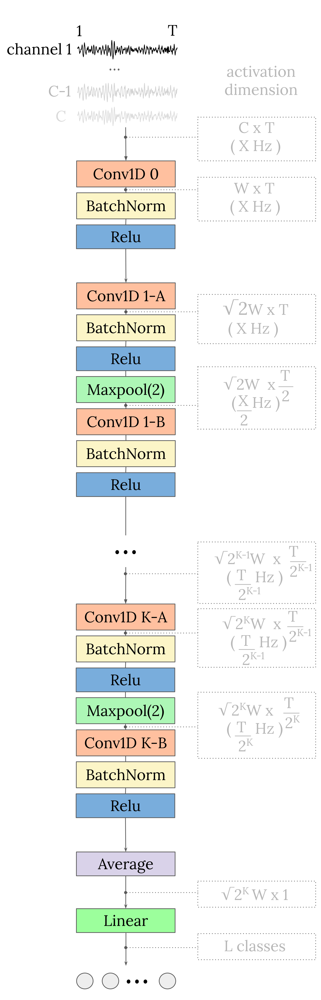

# EEGSimpleConv
In this repository we provide the code of the architecture of EEG-SimpleConv [1], aswell as all of the code required to reproduce main results of its paper (from the downloading of the dataset to the training of the models).
##### Main idea: architectures that relies only on simple 1D convolutions
# Repository structure
It consists of the following:

``` 
├── models
	└── EEGSimpleConv.py (file of the torch model)
├── scripts
    └── scripts.py (scripts required to train the model and reproduce the experiments of the paper)
├──  create_datasets.ipynb (notebook to download the datasets)
├──  run_results.ipynb (notebook to reproduce the main results of the paper)
├──  ML_baselines.ipynb (notebook to reproduce the results of the ML baselines of the paper)
├──  README.md
├──  requirements.txt
```

# Abstract
We propose EEG-SimpleConv, a straightforward 1D convolutional neural network for Motor Imagery decoding in BCI. Our main motivation is to propose a very simple baseline to compare to, using only very standard ingredients from the literature. We evaluate its performance on four EEG Motor Imagery datasets, including simulated online setups, and compare it to recent Deep Learning and Machine Learning approaches. EEG-SimpleConv is at least as good or far more efficient than other approaches, showing strong knowledge-transfer capabilities across subjects, at the cost of a low inference time. We advocate that using off-the-shelf ingredients rather than coming with ad- hoc solutions can significantly help the adoption of Deep Learning approaches for BCI. We make the code of the models and the experiments accessible in this repository.


<p align="center">
  
</p>


# Results
-   BCI_competition_IV2a - acc: 78.2% (Within session),  72.1 (Cross-Subject), 86.2 (Cross-Session with Fine-Tuning)
-   Zhou2016 - acc: 81.8 (Cross-Subject)
-   PhysionetMI - acc: 64.6 (Cross-Subject)
-   Cho2017 - acc: 75.4 (Cross-Subject)

More results are available in the paper, such as online-like evaluation results


# Citations
[1] A Strong and Simple Deep Learning Baseline for BCI MI Decoding, Yassine El Ouahidi, Vincent Gripon, Bastien Pasdeloup, Ghaith Bouallegue, Nicolas Farrugia, Giulia Lioi,  https://arxiv.org/abs/2309.07159
To cite please use:
```
@article{ouahidi2023strong,
  title={A Strong and Simple Deep Learning Baseline for BCI MI Decoding},
  author={Ouahidi, Yassine El and Gripon, Vincent and Pasdeloup, Bastien and Bouallegue, Ghaith and Farrugia, Nicolas and Lioi, Giulia},
  journal={arXiv preprint arXiv:2309.07159},
  year={2023}
}
```
